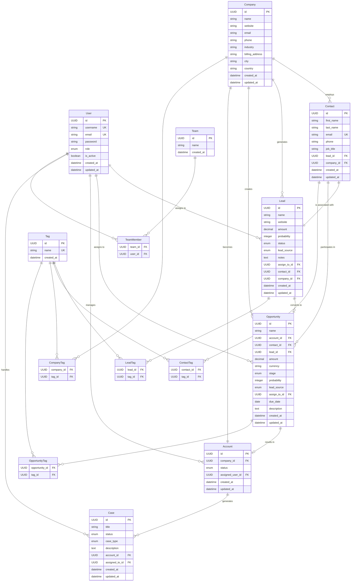
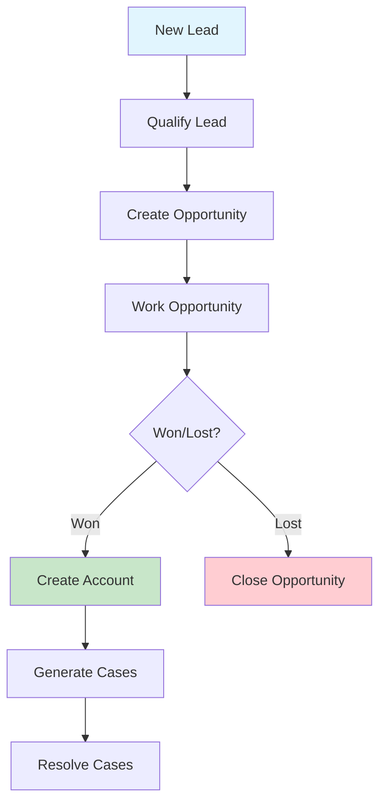

# Bottle CRM - Database Schema

## Entity Relationship Diagram



## Relationship Definitions

### Primary Relationships

1. **User Management**

   - User → Lead (1:M) - Users can be assigned to multiple leads
   - User → Opportunity (1:M) - Users manage multiple opportunities
   - User → Account (1:M) - Users handle multiple accounts
   - User → Case (1:M) - Users resolve multiple cases

2. **Sales Funnel Flow**

   ```
   Lead → Opportunity → Account → Case
   ```

3. **Company-Centric Relationships**

   - Company → Contact (1:M) - Companies have multiple contacts
   - Company → Lead (1:M) - Companies generate multiple leads
   - Company → Account (1:1) - Company becomes an Account when deal is won

4. **Contact Relationships**
   - Contact ↔ Lead (1:1) - Each lead has one primary contact
   - Contact → Opportunity (1:M) - Contacts can be involved in multiple opportunities

### Secondary Relationships

5. **Tagging System**

   - Tags can be applied to: Leads, Contacts, Companies, Opportunities
   - Many-to-Many relationships via junction tables

6. **Team Management**
   - Team ↔ User (M:M) - Users can belong to multiple teams

## Data Flow



## Key Business Rules

1. **Lead to Opportunity**: A Lead can be converted to an Opportunity
2. **Opportunity to Account**: A won Opportunity creates an Account
3. **Account to Case**: Accounts generate support Cases
4. **User Assignment**: All entities can be assigned to Users for responsibility
5. **Company Centricity**: Companies are central entities linking Contacts, Leads, and Accounts

## API Endpoints Mapping

Based on the ApiUrls.tsx file:

```typescript
// Current API endpoints
LoginUrl = 'auth/login';
UsersUrl = 'users'; // → User entity
LeadUrl = 'leads'; // → Lead entity
ContactUrl = 'contacts'; // → Contact entity
CompanyUrl = 'leads/company'; // → Company entity
OpportunityUrl = 'opportunities'; // → Opportunity entity
AccountsUrl = 'accounts'; // → Account entity
CasesUrl = 'cases'; // → Case entity
```

This schema provides a comprehensive CRM system supporting the full customer lifecycle from initial lead through ongoing account management and support.
